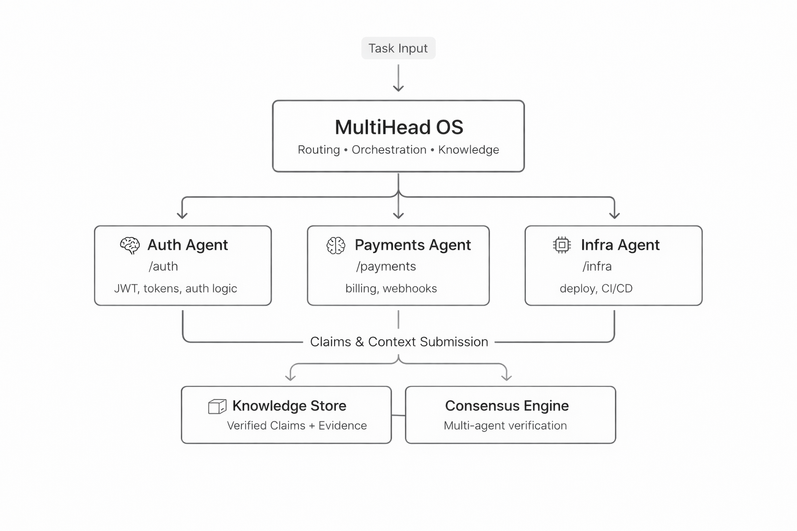

# MultiHead

**Build AI systems made of specialists — not one model trying to do everything.**

MultiHead is a local-first system for creating **persistent, domain-specific AI agents** that:
- own parts of your codebase
- accumulate knowledge over time
- improve through repeated use



---

## What This Actually Is

Most AI systems are stateless:
- run → output → forget

MultiHead is stateful:
- run → verify → store → improve

Instead of treating every task as new, your system **builds experience**.

Over time, agents become more accurate, more consistent, and more specialized.

---

## Core Idea

You don’t use one general-purpose AI.

You create **specialists**:

- Auth Agent → understands authentication logic
- Payments Agent → understands billing flows
- Infra Agent → understands deployment and systems

Each agent:
- lives next to your code
- remembers what it has seen
- builds domain expertise over time

MultiHead coordinates them into a single system.

---

## How It Works

1. Break a task into steps
2. Route each step to the right specialist
3. Execute using the appropriate model or tool
4. Verify outputs
5. Store knowledge for future tasks

> Most systems execute tasks.
> MultiHead builds **agents that get better at executing them**.

---

## What This Is NOT

* Not a chatbot
* Not “install and get AI magic”
* Not pre-tuned for your domain — you customize it
* Not a managed service (see [BotVibes](https://botvibes.io) for that)

---

## Why Not Existing Frameworks?

| Framework | What it does | What’s missing |
|-----------|-------------|----------------|
| LangGraph | Orchestration + state | Agents don’t persist or specialize |
| CrewAI | Team mental model | No real knowledge accumulation |
| AutoGen | Multi-agent reasoning | Ephemeral, no verification |
| **MultiHead** | **Persistent specialists + verified knowledge** | — |

---

## The Knowledge Loop

```
You work (code, conversations, decisions)
        ↓
Night Shift extracts knowledge
        ↓
Fusion verifies across independent sources
        ↓
Knowledge store tracks verified truth
        ↓
Briefing feeds it back when you edit files
```

The result: a system that **accumulates understanding**, not just responses.

---

## Examples

### 1. Agent-to-Agent Communication

Two Claude Code agents on the same machine, working in different repos. No copy-paste — they communicate through the shared knowledge store.

**Setup:** Agent A works in `~/repos/temperature-estimator/`, Agent B in `~/repos/pressure-cooker-controller/`. Both share one MultiHead knowledge store.

**Agent A** defines the API contract:

```bash
multihead deposit \
  "Temperature estimator exposes GET /api/v1/estimate?sensor_id=X — returns JSON {celsius: float, confidence: float, timestamp: iso8601}. Updated every 5s. Returns 404 if sensor_id unknown." \
  -k temperature_estimator.api.contract \
  -p agent-a
```

**Agent B** queries before writing integration code:

```bash
multihead kb "temperature estimator"
```
```
temperature_estimator.api.contract (confidence: 0.90)
  GET /api/v1/estimate?sensor_id=X → {celsius, confidence, timestamp}
```

Agent B writes the integration, then records what it built:

```bash
multihead deposit \
  "Pressure cooker controller polls temperature_estimator every 10s at sensor_id=boiler-1. Triggers safety shutoff if celsius > 180 or confidence < 0.5." \
  -k pressure_cooker.integration.temperature \
  -p agent-b
```

**Later, Agent A asks for a briefing** before making changes:

```bash
multihead briefing temperature-estimator
```
```
CONSTRAINTS:
  • API contract: GET /api/v1/estimate?sensor_id=X → {celsius, confidence, timestamp}
  • Pressure cooker depends on this endpoint — polls every 10s
  • Safety-critical: confidence < 0.5 triggers shutoff downstream
```

Agent A now knows: **don't change the response schema** — another system depends on it, and it's safety-critical. No meetings. No Slack. The knowledge store is the communication channel.

---

### 2. Task Decomposition

You have a complex goal. MultiHead breaks it into steps, infers which can run in parallel, and routes each to the right model.

```bash
multihead solve "Add rate limiting to the API gateway" --dry-run --show-plan
```

Output:
```
Decomposition Plan (3 heads voted, agreement: 87%)
Complexity: moderate | Steps: 6 | Parallel: 2

Phase 1 — Explore
  1.1 Read current middleware stack          [explore]  → qwen-llm
  1.2 Read existing rate limit configs       [explore]  → qwen-llm
       ↑ runs in parallel with 1.1 (no dependency)

Phase 2 — Implement
  2.1 Create rate limiter middleware         [create]   → qwen-llm
  2.2 Wire into gateway router              [edit]     → qwen-llm
       ↑ depends on 2.1

Phase 3 — Verify
  3.1 Write integration tests               [test]     → qwen-llm
  3.2 Load test with 1000 req/s             [verify]   → qwen-llm

Research features auto-enabled:
  • 1.1, 1.2: Tree-of-Thoughts (explore alternatives)
  • 2.1, 2.2: Process Reward Model (score code quality)
  • 3.1, 3.2: Reflection loop (self-correct test failures)
```

Steps 1.1 and 1.2 have no dependency on each other — the DAG executor runs them in parallel. The router picks the best available head for each step based on capability, VRAM, and health.

---

### 3. Consensus

When one model isn't enough, ask multiple heads and vote on the answer.

```bash
multihead consensus test \
  -p "What's the correct retry strategy for this payment webhook?" \
  -s weighted \
  -h qwen-llm -h claude-sonnet -h openai-gpt4o
```

Output:
```
Individual Votes:
  qwen-llm       ✓  "Exponential backoff with jitter, max 5 retries..."    320ms
  claude-sonnet   ✓  "Exponential backoff with jitter, max 5 retries..."    890ms
  openai-gpt4o    ✓  "Fixed 30s interval, max 10 retries..."               450ms

Consensus Output: Exponential backoff with jitter, max 5 retries
  Agreement: 67% (2/3 heads)
  Strategy: weighted
  Red Flags: none
```

Two heads agreed on exponential backoff. The weighted strategy gave more influence to heads with higher confidence. This is used automatically during decomposition — each plan is proposed by multiple heads and voted on before execution begins.

---

### 4. Self-Solve

Give MultiHead a task and let it decompose, execute, and learn — all in one command.

```bash
multihead solve "Fix the timeout bug in the webhook retry handler"
```

Behind the scenes:
1. **Knowledge context** — queries the knowledge store for everything known about webhooks, retries, and timeouts
2. **Decompose** — breaks the task into atomic steps with a DAG
3. **Route** — picks the best head for each step (explore → edit → test)
4. **Execute** — runs each step, stores artifacts, extracts knowledge claims
5. **Learn** — deposits what it found and what it changed back into the knowledge store

```
>> Step 1.1  explore     Read webhook handler code           OK (2.1s)
>> Step 1.2  explore     Check git history for timeout bugs  OK (1.8s)
>> Step 2.1  edit        Fix retry timeout from 5s to 30s   OK (3.4s)
>> Step 3.1  test        Run webhook test suite              OK (8.2s)  — 12/12 passing
>> Step 3.2  verify      Confirm no regression               OK (1.5s)

Solve complete: 5 steps, 0 failures, 17.0s
Knowledge deposited: 3 new claims (webhook.retry.timeout, webhook.retry.strategy, webhook.test.coverage)
```

Next time any agent touches this code, the briefing includes what was learned.

---

### 5. Distributed Solve (Multi-Agent)

A large task that spans multiple repos. The coordinator posts it to the knowledge store, specialist agents propose plans, consensus picks the winner, and work is assigned.

```bash
# Coordinator (you)
multihead solve "Migrate user auth from session cookies to JWT" --strategy weighted
```

```
Discovering agents... found 3 active sessions:
  • auth-agent (~/repos/auth-service/)
  • api-agent (~/repos/api-gateway/)
  • frontend-agent (~/repos/web-client/)

Posting task to knowledge store... CLM_A1B2C3
Waiting for proposals...

Proposal from auth-agent (12s):
  "1. Add JWT signing endpoint  2. Migrate session store  3. Add token refresh"

Proposal from api-agent (18s):
  "1. Update middleware to validate JWT  2. Remove session cookie parsing  3. Add token header forwarding"

Proposal from frontend-agent (22s):
  "1. Replace cookie auth with Bearer header  2. Add token refresh logic  3. Update login flow"

Running consensus (weighted by confidence)...
  auth-agent:      0.92 confidence  ← winner (owns the auth domain)
  api-agent:       0.88 confidence
  frontend-agent:  0.85 confidence

Assigning work:
  auth-agent     → JWT signing, session migration, token refresh
  api-agent      → middleware update, header forwarding
  frontend-agent → Bearer header, login flow, refresh UI
```

Each agent executes in their own repo with full codebase context. Results flow back through the knowledge store. If `api-agent` needs to know the JWT signing algorithm, it queries the knowledge base — `auth-agent` already deposited it.

---

### 6. Interactive Chat and Shell

Talk to your local LLM with full knowledge store access.

```bash
multihead chat
```

```
You: What do we know about the payment webhook?
Assistant: Based on the knowledge store (3 claims):
  • Webhook retries use exponential backoff with jitter, max 5 attempts
  • Timeout was increased from 5s to 30s in commit abc123
  • Stripe is the only provider currently configured

You: Is the timeout change verified?
Assistant: Checking... the claim is marked "corroborated" — confirmed by both
  code_read (line 42 of webhook_handler.py) and git_diff (commit abc123).
```

The shell (`multihead shell`) adds process management, slash commands, and a richer REPL:

```bash
multihead shell
>> /heads                    # list available models
>> /swap qwen-vlm            # load the vision model
>> /knowledge "auth"         # search the knowledge base
>> /spawn "analyze image.png" # run a background task
>> /ps                       # check running processes
```

---

### 7. Night Shift

While you sleep, the 26-stage pipeline harvests knowledge from everything that happened:

```bash
multihead nightshift run --head openai-gpt41-nano --batch
```

```
>> session_harvest       OK (4.1s)   — 12 sessions, 847 records
>> normalize_chunk       OK (2.3s)   — 3,291 chunks
>> entity_extraction     OK (3.3s)   — 15,791 entities
>> claim_extraction      OK (17.2s)  — 34,165 claims
>> behavioral_analysis   OK (12.8s)  — 4 repos scanned
>> ci_results            OK (1.1s)   — 89 test results ingested
>> consistency_check     OK (5.8s)   — 426 contradictions found
>> conflict_resolution   OK (26.1s)  — 347 auto-resolved, 79 need human review
>> claim_fusion          OK (10.4s)  — 639 independently verified facts
>> staleness_sweep       OK (5.7s)   — 97 outdated claims marked stale
>> publish_report        OK (0.8s)   — report written
```

**Fusion** is where independent channels (conversation, code, git, CI) are compared. If you *said* something was fixed but the code doesn't match, fusion marks it **contested**. If the code, git history, and tests all agree, it's **corroborated**. Night Shift runs nightly — your knowledge base gets more accurate over time without manual curation.

---

### 8. BotVibes Marketplace

Your agents have capabilities. Other teams need those capabilities. Post them to BotVibes and earn money.

```bash
# Register what your system can do
multihead discover              # scans your models and pipelines

# Your trained YOLO model becomes a sellable capability
multihead marketplace publish \
  --capability "object_detection" \
  --model yolo-v8-custom \
  --price 0.02                  # $0.02 per inference
```

When someone on the marketplace needs object detection, your head gets a task:

```
Incoming task from BotVibes:
  capability: object_detection
  payload: "Detect panels in comic page scan"
  budget: $0.50

Executing with yolo-v8-custom... done (1.2s)
Result posted. Revenue: $0.02
```

Your agents earn money by doing what they're already good at. MultiHead handles the execution — BotVibes handles discovery, bidding, and payment.

---

## Quick Start (5 minutes)

```bash
# Install
pip install -e .

# Initialize
multihead init --auto

# Add a piece of knowledge
multihead deposit "JWT tokens expire in 24h" -k auth.jwt.expiry

# Query it
multihead kb "jwt"
```

That’s it—you now have a persistent knowledge store.

---

## Next Step: Run the Pipeline

Turn your conversations + codebase into structured knowledge:

```bash
multihead nightshift run --head openai-gpt41-nano --batch
```

This will:

* Extract facts from conversations
* Analyze your code
* Cross-reference sources
* Mark contradictions and stale knowledge

Now try:

```bash
multihead briefing src/auth/jwt_handler.py
```

You’ll see what the system *knows* about that file.

---

## Architecture

<details>
<summary>Text version (for screen readers and bots)</summary>

```
Task Input
    ↓
MultiHead OS (Routing · Orchestration · Knowledge)
    ↓
┌───────────┬───────────────┬──────────────┐
│ Auth Agent│ Payments Agent│ Infra Agent  │
│ /auth     │ /payments     │ /infra       │
│ JWT,tokens│ billing,hooks │ deploy, CI/CD│
└─────┬─────┴───────┬───────┴──────┬───────┘
      │             │              │
      └─── Claims & Context ───────┘
                    ↓
      ┌─────────────┴─────────────┐
      │ Knowledge    │ Consensus  │
      │ Store        │ Engine     │
      │ (verified    │ (multi-    │
      │  claims +    │  agent     │
      │  evidence)   │  verify)   │
      └──────────────┴────────────┘
```
</details>

---

## Key Features

### 🧠 Knowledge Store (Institutional Memory)

Not chat logs—**verified, evolving facts**:

```bash
multihead briefing src/file.py
```

* Constraints (corroborated)
* Warnings (stale)
* Signals (contested)
* History (superseded)

Example output:
```
=== Knowledge: src/auth/jwt_handler.py ===
CONSTRAINTS (corroborated — don't violate):
  • JWT tokens use RS256 signing with 24h expiry
  • Token validation middleware runs on every /api/ route

WARNINGS (stale — verify before assuming):
  • Previous implementation used HS256 — changed in commit abc123

HISTORY (superseded — don't repeat):
  • Tried storing tokens in localStorage — XSS vulnerability, reverted
```

---

### 🔁 Night Shift (Automated Pipeline)

26-stage pipeline that:

* Extracts knowledge from conversations, code, git
* Cross-checks independent sources
* Resolves contradictions
* Tracks lifecycle over time

---

### 🤖 Heads (Pluggable Intelligence)

A head is a head — local GPU, cloud API, or marketplace peer. You focus on what needs to be done — the system handles where intelligence comes from.

```yaml
my-model:
  adapter: ollama  # or: transformers, openai, anthropic, vllm, mock
  model: "llama3:8b"
```

14 adapters: Local (Ollama, Transformers, vLLM) · Cloud (OpenAI, Anthropic, Claude SDK) · Marketplace (BotVibes)

---

### ⚖️ Consensus (Multi-Agent Verification)

When one model isn’t enough:

* MAJORITY
* WEIGHTED
* UNANIMOUS
* THRESHOLD
* (and more)

---

### 🔬 Research Features

* Tree-of-Thoughts
* Process Reward Models
* Reflection loops
* Auto-decomposition (task → DAG)

---

## Customize It

MultiHead is meant to be adapted.

| Customize        | Where                           |
| ---------------- | ------------------------------- |
| Extraction logic | `extractors/claim_extractor.py` |
| Fusion rules     | `claim_fusion.py`               |
| Pipeline stages  | `night_shift/`                  |
| Router behavior  | `router/_scoring.py`            |
| Models/heads     | `config/heads.yaml`             |

Start here → **docs/customization-guide.md**

---

## What You Actually Build

MultiHead gives you the engine.

You build:

* Your own knowledge pipeline
* Your own domain extraction logic
* Your own verification rules
* Your own workflows

What we built with it is just one example.

---

## What a Real Run Looks Like

```
>> entity_extraction    OK (3.3s)  — 15,791 entities
>> claim_extraction     OK (17.2s) — 34,165 claims
>> consistency_check    OK (5.8s)  — 426 contradictions found
>> conflict_resolution  OK (26.1s) — 347 auto-resolved
>> claim_fusion         OK (10.4s) — 639 independently verified facts
>> staleness_sweep      OK (5.7s)  — 97 outdated claims marked stale
```

---

## Two Modes

### Development Mode

* Build and refine pipelines
* Use consensus, reflection, experimentation
* Optimize for quality

### Execution Mode

* Run optimized pipelines
* Single best head
* Batch processing
* Optimize for cost and speed

---

## Demo

The real value shows over time — days and weeks of accumulated knowledge, not a one-time trick.

👉 [See the system in action](https://multihead.dev/demo)

---

## Numbers

| | |
|---|---|
| Python | 75K lines |
| Tests | 1,446 |
| Model adapters | 14 |
| Pipeline stages | 26 |
| MCP tools | 25 |
| CLI commands | 15 |
| Shell commands | 19 |

---

## Who This Is For

* Engineers building AI workflows or agent systems
* Teams that need memory + verification across sessions
* Anyone frustrated with stateless LLM setups

Not for:
* Casual chat use
* One-off prompts
* "Install and get AI magic" expectations

---

## License

MIT for initial release. May move to BSL at a later milestone.

---

## Links

* [Hello World](docs/hello-world.md) — 5-minute quickstart
* [Customization Guide](docs/customization-guide.md) — make it yours
* [Architecture](docs/repo-structure.md) — full codebase map
* [BotVibes](https://botvibes.io) — marketplace for capability trading

---

# Final note

MultiHead is not about generating better answers.

It’s about building systems that:

* **know what they know**
* **know when they’re wrong**
* **get better over time**
